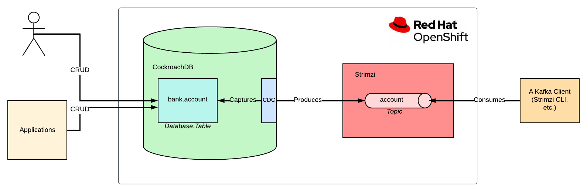

# Change Data Capture with CockroachDB and Strimzi

Change Data Capture (CDC) is a data integration pattern that enables capturing row-level changes into a configurable sink for downstream processing such as reporting, caching, full-text indexing, or most importantly helping with *avoiding dual writes*.

Many technologies implement CDC as either a part of their product's solution or the main functionality of an open-source project like [Debezium](https://debezium.io/).

CockroachDB is one of those technologies that [implement CDC](https://www.cockroachlabs.com/docs/stable/change-data-capture-overview.html) as a part of their product features.

CockroachDB is a distributed database that supports standard SQL.
It is designed to survive software and hardware failures, from server restarts to data center outages.

While CockroachDB is designed to be `excellent`, it needs to coexist with other systems like full-text search engines, analytics engines or data pipeline systems.
Because of that, it has [Changefeeds](https://www.cockroachlabs.com/docs/v21.2/create-changefeed), which enable data sinks like AWS S3, webhooks and most importantly Apache Kafka or Strimzi: a Kafka on Kubernetes solution.

Strimzi is a [CNCF](https://www.cncf.io/) sandbox project, which provides an easy way to run and manage an Apache Kafka cluster on Kubernetes or OpenShift.
Strimzi is a [Kubernetes Operator](https://www.redhat.com/en/topics/containers/what-is-a-kubernetes-operator#:~:text=A%20Kubernetes%20operator%20is%20an,behalf%20of%20a%20Kubernetes%20user.), and it provides an easy and flexible configuration of a Kafka cluster, empowered by the capabilities of Kubernetes/OpenShift.

In this tutorial, you will:

* Run a Kafka cluster on OpenShift/Kubernetes.
* Create a topic within Strimzi by using its the Strimzi CLI.
* Create a CockroachDB cluster on OpenShift and use its SQL client.
* Create a table on CockroachDB and configure it for using CDC.
* Create, update, delete records in the CockroachDB table.
* Consume the change events from the relevant Strimzi topic by using the Strimzi CLI.

## Prerequisites

You’ll need the following for this tutorial:

* [oc CLI](https://docs.openshift.com/container-platform/4.7/cli_reference/openshift_cli/getting-started-cli.html).
* [Strimzi CLI](https://github.com/systemcraftsman/strimzi-kafka-cli#installation).
* A [30-days trial license](https://www.cockroachlabs.com/get-cockroachdb/enterprise/) for CockroachDB.
This is required to use CockroachDB's CDC feature.
* You must have Strimzi 0.26.1 or AMQ Streams 2.1.0 operator installed on your OpenShift/Kubernetes cluster.
* You must have CockroachDB 2.3.0 operator installed on your OpenShift/Kubernetes cluster.

## CockroachBank's Requirements

Suppose that you are a consultant who works for a customer, CockroachBank LLC.

They use CockroachDB on OpenShift and most of the daily bank account transactions are kept in this database.
Currently, they have a mechanism for indexing the bank account transaction changes in Elasticsearch but they noticed that it creates data inconsistencies between the actual data and the indexed log data that is in Elasticsearch.

They want you to create a core mechanism that avoids any data inconsistency issue between systems.
They require you to create a basic implementation of a CDC by using CockroachDB's `Changefeed` mechanism and because they use CockroachDB on OpenShift, they would like you to use Strimzi.

You do not need to implement the Elasticsearch part, but only the CDC part.
To simulate the CockroachBank system, you must install the AMQ Streams and CockroachDB operators on your OpenShift cluster and create their instances.

The following image is the architectural diagram of the system they require you to implement:



## Creating a Strimzi Cluster

To create a Strimzi cluster, you need a namespace/project created on your OpenShift/Kubernetes cluster.
You can use the `oc` CLI to create a namespace/project.

```shell
oc new-project cockroachbank
```

Run the `kfk` command of Strimzi CLI to create a Kafka cluster with one broker.
A small cluster with one broker is enough for a demo.

```shell
export STRIMZI_KAFKA_CLI_STRIMZI_VERSION=0.26.1 && \
kfk clusters --create \
--cluster my-cluster \
--replicas 1 \
--zk-replicas 1 \
-n cockroachbank -y
```

---
**NOTE**

[Download the Strimzi CLI Cheat Sheet from here](https://www.systemcraftsman.com/strimzi-cli-cheat-sheet/) if you are interested more.

---

Verify that you have all the Strimzi pods up and running in `Ready` state.

```shell
oc get pods -n cockroachbank
```

The output should be as follows:

```shell
NAME                                          READY   STATUS    ...
...output omitted...
my-cluster-entity-operator-64b8dcf7f6-cmjz8   3/3     Running   ...
my-cluster-kafka-0                            1/1     Running   ...
my-cluster-zookeeper-0                        1/1     Running   ...
...output omitted...
```

## Running CockroachDB on OpenShift

To install CockroachDB on your OpenShift cluster, [download the CockroachDB cluster custom resource](), which the CockroachDB operator creates the cluster for you by using the resource definition you provide in the YAML.

```shell
oc create -f crdb-cluster.yaml -n cockroachbank
```

Verify that you have all the CockroachDB pods up and running in `Ready` state.

```shell
oc get pods -n cockroachbank
```

The output should be as follows:

```shell
NAME                                          READY   STATUS    ...
...output omitted...
crdb-tls-example-0                            1/1     Running   ...
crdb-tls-example-1                            1/1     Running   ...
crdb-tls-example-2                            1/1     Running   ...
...output omitted...
```

In another terminal run the following command to access CockroachDB SQL client interface:

```shell
oc rsh -n cockroachbank crdb-tls-example-0 cockroach sql --insecure
```

On the SQL client interface, run the following commands to enable the trial for enterprise usage.
You must do this because CDC is a part of the `Enterprise Changefeeds` and you need an enterprise license.
Refer to the `Prerequisites` part of this tutorial if you did not get a trial license yet.

```shell
SET CLUSTER SETTING cluster.organization = '_YOUR_ORGANIZATION_';
```

```shell
SET CLUSTER SETTING enterprise.license = '_YOUR_LICENSE_';
```

## Creating and Configuring a CockroachDB Table

On the SQL query client terminal window, run the following command to create a database called `bank` on CockroachDB.

```sql
root@:26257/defaultdb> CREATE DATABASE bank;
```

Select the `bank` database to use for the rest of the actions in the query window.

```sql
root@:26257/defaultdb> USE bank;
```

Create a table called `account` with the `id` and `balance` fields.

```sql
root@:26257/bank> CREATE TABLE account (id INT PRIMARY KEY, balance INT);
```

Create a `Changefeed` for the table `account`.
Set the xxxx broker address for the Changefeed, to specify the broker to send the captured change data:

```sql
root@:26257/bank> CREATE CHANGEFEED FOR TABLE account INTO 'kafka://my-cluster-kafka-bootstrap:9092' WITH UPDATED;
```

Notice that you use `my-cluster-kafka-bootstrap:9092` for the Kafka bootstrap address.
This is the service URL that Strimzi provides for the Kafka cluster `my-cluster` you have created.

---
**NOTE**

For more information on creating a `Changefeed` on CockroachDB refer to this [documentation page](https://www.cockroachlabs.com/docs/v21.2/create-changefeed).

---

Leave the terminal window open for further instructions.

## Creating a Strimzi Topic and Consuming Data

In another terminal window run the following command to create a topic called `account`:

```shell
kfk topics --create --topic account \
--partitions 1 --replication-factor 1 \
-c my-cluster -n cockroachbank
```

The output must be as follows:

```shell
kafkatopic.kafka.strimzi.io/account created
```

---
**IMPORTANT**

A topic with 1 partition and 1 replication factor is enough for this demonstration.
If you have a Strimzi Kafka cluster with more than 1 broker, then you can configure your topic differently.

---

Notice that it is the same name as the CockroachDB table `account`.
CockroachDB CDC produces change data into a topic with the same name as the table by default.

In the same terminal window run the following command to start consuming from the `account` topic:

```shell
kfk console-consumer --topic account \
-c my-cluster -n cockroachbank
```

Leave the terminal window open to see the consumed messages for the further steps.

## Capturing the Change Event Data

In the SQL client terminal window, run the following command to insert a sample account data into the `account` table.

```sql
root@:26257/bank> INSERT INTO account (id, balance) VALUES (1, 1000), (2, 250), (3, 700);
```

This should create the following accounts in the CockroachDB `account` table:


| **id**              | **balance**                                                      |
|----------------------|----------------------------------------------------------------|
| 1      | 1000                   |
| 2               | 250                                           |
| 3 | 700 |

After inserting the data, verify that the Strimzi CLI consumer prints out the consumed data:

```
{"after": {"balance": 1000, "id": 1}, "updated": "1655075852039229718.0000000000"}
{"after": {"balance": 250, "id": 2}, "updated": "1655075852039229718.0000000000"}
{"after": {"balance": 700, "id": 3}, "updated": "1655075852039229718.0000000000"}
```

To observe some more event changes on the topic data, run the following queries on the SQL client to change the balance between accounts.


```sql
root@:26257/bank> UPDATE account SET balance=700 WHERE id=1;
root@:26257/bank> UPDATE account SET balance=600 WHERE id=2;
root@:26257/bank> UPDATE account SET balance=650 WHERE id=3;
```

Verify that the new changes, which CDC of CockroachDB captures, are printed out by the Strimzi CLI consumer.
In the consumer's terminal window, you should see a result as follows:

```
...output omitted...
{"after": {"balance": 700, "id": 1}, "updated": "1655075898837400914.0000000000"}
{"after": {"balance": 600, "id": 2}, "updated": "1655075904775509980.0000000000"}
{"after": {"balance": 650, "id": 3}, "updated": "1655075910511670876.0000000000"}
```

Notice the balance changes that represent a transaction history in the consumer output.

As the last step, delete the bank account to see how CockroachDB CDC captures them.
Run the following SQL query in the query console of CockroachDB:

```sql
root@:26257/bank> DELETE FROM bank.account where id <> 0;
```

The Strimzi CLI consumer should print the following captured events:

```
...output omitted...
{"after": null, "updated": "1655075949177132715.0000000000"}
{"after": null, "updated": "1655075949177132715.0000000000"}
{"after": null, "updated": "1655075949177132715.0000000000"}
```

Notice that the `after` field becomes `null` when the change data is a `delete` event.


## Conclusion

Congratulations! You've successfully captured the bank account transaction changes, and made it consumable as change events via Strimzi.

In this tutorial, you have learned how to run a Kafka cluster on OpenShift by using Strimzi, how to create a topic by using the Strimzi CLI.
Also, you have learned to install CockroachDB on OpenShift, create a table by using its SQL query interface, and configure it for using CDC.
You've created change events on a CockroachDB table and consumed those events from the Strimzi Kafka topic by using the Strimzi CLI.
